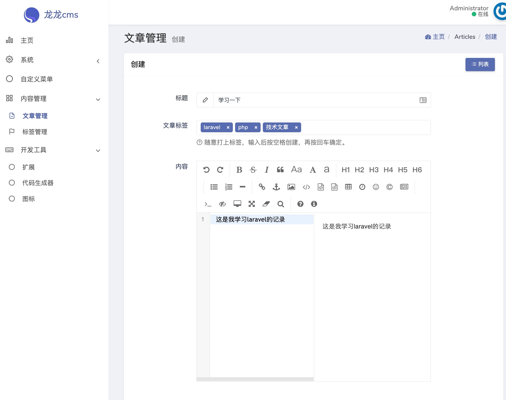
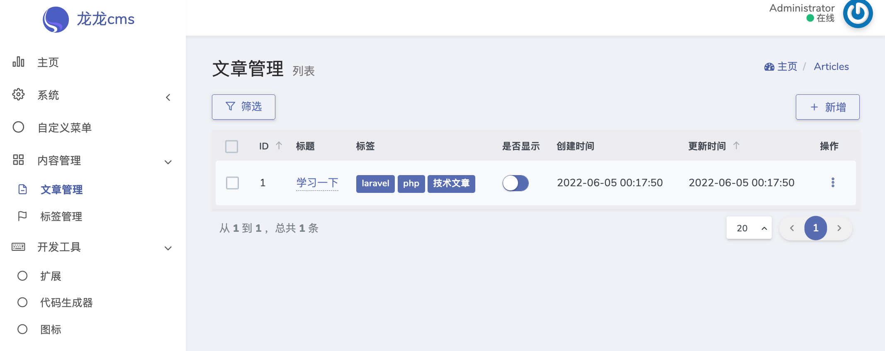
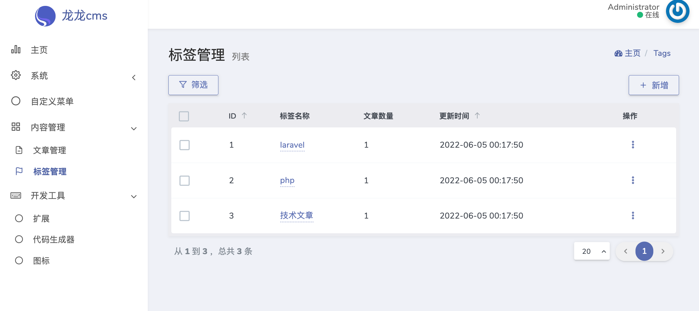

# 文章管理 Dcat Admin Extension







# 安装

# 注意 如果你的系统存在表 articles 和 tags 请勿安装..自行修改插件后在安装


下载本项目的zip  然后在 `开发工具->扩展` 安装本扩展

# 卸载
把表 `article_tag` `articles` `tags`删除即可默认点卸载会删除的 没删掉的话 自行删除


# 路由

文章管理 `/admin/articles`

标签管理 `/admin/tags`

```php
Route::resource('articles', Controllers\ArticleController::class);
Route::resource('tags', Controllers\TagController::class);

```

# 
